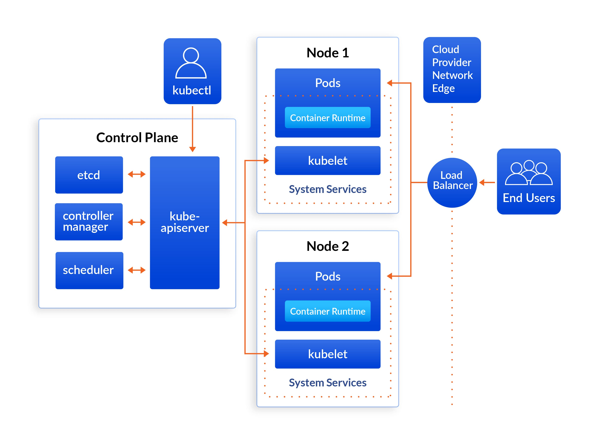

# Kubernetes Architecture

Kubernetes uses a **client-server architecture**, organizing machines into a **cluster**.  
This cluster is comprised of:

- **Control Plane** → the "brain" of the cluster, making decisions and orchestrating the system.  
- **Worker Nodes** → the "muscles" where your applications and workloads actually run.  

The goal of this architecture is to provide a **highly available and self-healing environment** for containerized applications.

---

## Control Plane Components

- **API Server**  
  The front-end of the Control Plane.  
  It’s the central hub for all communication and provides the **Kubernetes API**.  
  All other components, including `kubectl`, communicate with the cluster through this server.

- **etcd**  
  A consistent and highly available key-value store.  
  It serves as the **single source of truth** for the cluster’s state, storing all configuration data.

- **Scheduler**  
  Watches for new pods that have no assigned node and selects the best node for them to run on,  
  based on resource availability and other constraints.

- **Controller Manager**  
  Runs various controllers that continuously monitor the state of the cluster  
  and ensure it matches the **desired state**.  
  Example: A **Replication Controller** ensures the correct number of pod replicas are running.

---

## Worker Node Components

- **Kubelet**  
  An agent that runs on each worker node.  
  Communicates with the API server, ensuring containers are running in a pod and remain healthy.

- **Kube-Proxy**  
  A network proxy that runs on each node.  
  Maintains network rules, allowing communication **between pods** and from **external sources** to pods.

- **Container Runtime**  
  The software responsible for running the containers.  
  Examples: **containerd, CRI-O, or Docker**.

